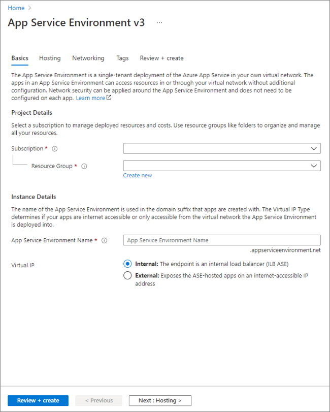

# Activate Azure with App Service Environment

## Student Lab Manual

*Version 1.0*

*February 2022*

------

**Conditions and Terms of Use**

Microsoft Confidential 

 

This training package is proprietary and confidential, and is intended only for uses described in the training materials. Content and software is provided to you under a Non-Disclosure Agreement and cannot be distributed. Copying or disclosing all or any portion of the content and/or software included in such packages is strictly prohibited.

The contents of this package are for informational and training purposes only and are provided "as is" without warranty of any kind, whether express or implied, including but not limited to the implied warranties of merchantability, fitness for a particular purpose, and non-infringement.

Training package content, including URLs and other Internet Web site references, is subject to change without notice. Because Microsoft must respond to changing market conditions, the content should not be interpreted to be a commitment on the part of Microsoft, and Microsoft cannot guarantee the accuracy of any information presented after the date of publication. Unless otherwise noted, the companies, organizations, products, domain names, e-mail addresses, logos, people, places, and events depicted herein are fictitious, and no association with any real company, organization, product, domain name, e-mail address, logo, person, place, or event is intended or should be inferred. 

 

© 2022 Microsoft Corporation. All rights reserved.

------

**Copyright and Trademarks**

© 2019 Microsoft Corporation. All rights reserved.

 

Microsoft may have patents, patent applications, trademarks, copyrights, or other intellectual property rights covering subject matter in this document. Except as expressly provided in written license agreement from Microsoft, the furnishing of this document does not give you any license to these patents, trademarks, copyrights, or other intellectual property.

Complying with all applicable copyright laws is the responsibility of the user. Without limiting the rights under copyright, no part of this document may be reproduced, stored in or introduced into a retrieval system, or transmitted in any form or by any means (electronic, mechanical, photocopying, recording, or otherwise), or for any purpose, without the express written permission of Microsoft Corporation. 

For more information, see Use of Microsoft Copyrighted Content at
 http://www.microsoft.com/en-us/legal/intellectualproperty/Permissions/default.aspx

 

Azure, Microsoft, MSDN, Microsoft Dynamics logo, Visual Studio, Visual Studio Design, 2019, Windows Server, and Windows are either registered trademarks or trademarks of Microsoft Corporation in the United States and/or other countries. Other Microsoft products mentioned herein may be either registered trademarks or trademarks of Microsoft Corporation in the United States and/or other countries. All other trademarks are property of their respective owners.

------

## Contents

[TOC]

# Exercise 1 - Create a Resource Group

1. On the Azure portal menu or from the **Home** page, select **Create a resource**.

2. In the **Search services and marketplace** search bar, search for **Resource Group**

   

   3. Click on **Create**
   4. From the **Basics** tab:
      1. For **Subscription**, select the appropriate subscription
      2. For **Resource Group**, give the resource group an appropriate name
      3. For **Region**, select an appropriate region
      4. Click on **Review + Create**
      5. Click on **Create**

# Exercise 2 - Create a Virtual Network

1. On the Azure portal menu or from the **Home** page, select **Create a resource**.
2. Select **Networking** and then select **Virtual Network** -> **Create** in the **Popular Azure services** list or search for **Virtual Network** in the **Search services and marketplace** search bar.
3. From the **Basics** tab:
   1. For **Subscription**, select the appropriate subscription
   2. For **Resource Group**, select the resource group created in Exercise 1
   3. For **Name**, enter an appropriate name. (Example: vnet-asev3)
   4. For **Region**, select the appropriate region
   5. Click on **Next: IP Addresses**
4. From the **IP Addresses** tab:
   1. Create a subnet that will eventually hold the Application Gateway:
      1. Click on **+ Add subnet**
      2. In the **Subnet name** textbox, type in **appgw-subnet**
      3. In the **Subnet address range** textbox, type in an appropriate subnet, for example **10.2.1.0/24**
      4. Click on **Add**
   2. You should now have two subnets listed (**default** and **appgw-subnet**).  If you do not have two, please add a second one following the steps above.
    
   3. Click on **Review + Create**
5. Click on **Create**

# Exercise 3 - Create a ILB App Service Environment v3

1. On the Azure portal menu or from the **Home** page, select **Create a resource**.

2. In the **Search services and marketplace** search bar, search for **App Service Environment v3**

3. Click **Create**

4. From the **Basics** tab:

   1. For **Subscription**, select the appropriate subscription. 

   2. For **Resource Group**, select the resource group created in Exercise 1

   3. For **App Service Environment Name**, enter an appropriate name.  NOTE: Ensure this name is globally unique.

   4. For **Virtual IP**, select **Internal** 

   5. Click on **Next: Hosting**

      

   

3. From the **Hosting** tab:

   1. For **Physical hardware isolation**, select **Disabled**. 

   2. For **Zone redundancy**, select **Disabled**. 

   3. Click on **Next: Networking**
   
      

​     

4. From the **Networking** tab
   1. For **Virtual Network**, select the virtual network created in Exercise 2.
   2. For **Subnet**, click on **Create new**.
      1. For **Subnet Name**, enter an appropriate subnet name (Example: ase-subnet)
      2. Click **OK**
   3. For **DNS**, select **Azure DNS Private zone**.
   4. Click on **Review + Create**

​        

5. From the **Review + create** tab, click on **Create**.

NOTE:  The creation of an ASEv3 can take 2 to 3 hours.

